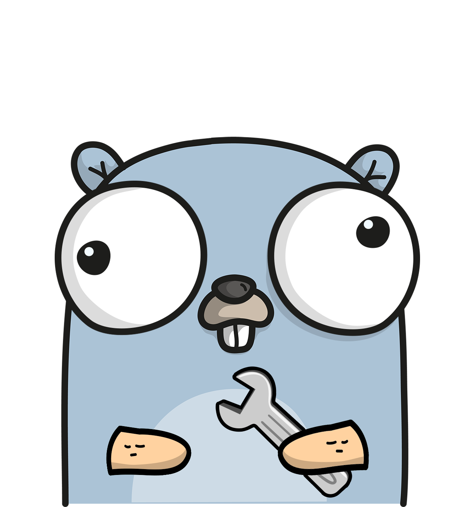

## RSS AGGREGATOR

### Packages used
- [go-chi](https://github.com/go-chi/chi) : Lightweight, idiomatic and composable router for building Go HTTP services
- [go-chi/cors](https://github.com/go-chi/cors) : CORS net/http middleware for Go
- [godotenv](https://github.com/joho/godotenv) : Loads environment variables from .env files
- [pq](https://github.com/lib/pq) : Pure Go Postgres driver for database/sql

### Entity Relation Diagram

<em>ERD generated by PostgreSQl PgAdmin</em>

